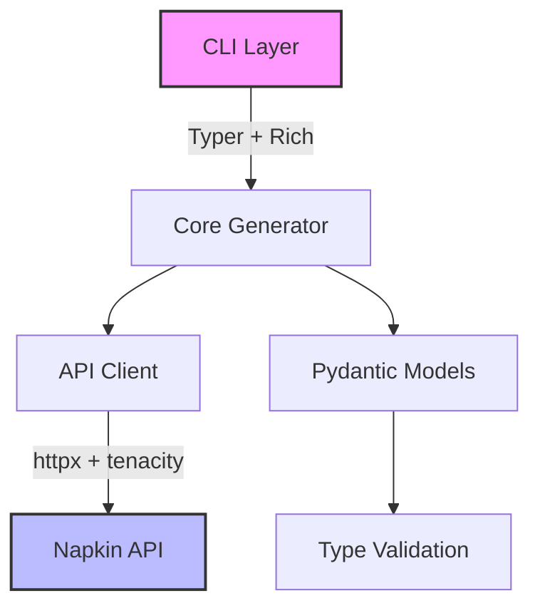

# 🎨 Napkin AI API Playground

<div align="center">


**Transform text into stunning visuals with the power of AI** ✨

[Features](#-features) • [Quick Start](#-quick-start) • [Installation](#-installation) • [Documentation](#-documentation) • [Contributing](#-contributing)

</div>

---

## 🚀 What is Napkin AI API Playground?

A powerful Python CLI and async client library that seamlessly transforms your text into professional-grade visuals using the Napkin AI API. Built with modern Python practices, it features robust error handling, intelligent retries, and a delightful developer experience.

### 🎯 Perfect for:
- 📊 **Data Scientists** - Visualize complex concepts instantly
- 👩‍💻 **Developers** - Generate architecture diagrams from descriptions
- 📚 **Educators** - Create engaging visual content for teaching
- 💼 **Product Managers** - Quickly sketch out ideas and workflows

## ✨ Features

<table>
<tr>
<td>

### 🎨 15+ Visual Styles
Choose from vibrant, sketch, corporate, minimalist, and more

### 📐 Flexible Output
Generate SVG for scalability or PNG with custom dimensions

### ⚡ Async Performance
Built on httpx with intelligent retry logic and rate limiting

</td>
<td>

### 🛡️ Type-Safe
Full Pydantic v2 validation and mypy type checking

### 🎯 Smart Defaults
Production-ready configuration out of the box

### 📊 Rich Terminal UI
Beautiful progress bars and formatted output with Rich

</td>
</tr>
</table>

## 🚦 Quick Start

### 1️⃣ Install
```bash
# Clone the repository
git clone https://github.com/yourusername/napkin-api-playground.git
cd napkin-api-playground

# Install with Poetry
poetry install
```

### 2️⃣ Configure
```bash
# Copy example config
cp .env.example .env

# Add your API token (get one at api@napkin.ai)
# Edit .env and set: NAPKIN_API_TOKEN=your_token_here
```

### 3️⃣ Generate!
```bash
# Your first visual
poetry run napkin generate "Machine Learning Pipeline"

# Activate environment for easier usage
source .venv/bin/activate
napkin generate "Software Architecture"
```

## 🎮 CLI Commands

### 🖼️ Generate Visuals
```bash
# Simple generation
napkin generate "Your amazing idea"

# With style and format
napkin generate "Data Flow" --style sketch-notes --format png

# Multiple variations
napkin generate "System Design" --variations 4

# Custom dimensions (PNG only)
napkin generate "Architecture" --format png --width 1920 --height 1080

# With context
napkin generate "Neural Network" \
  --context-before "Introduction to" \
  --context-after "for beginners"
```

### 🎨 Browse Styles
```bash
# List all available styles
napkin styles --list

# Filter by category
napkin styles --category colorful
```

### ⚙️ Configuration
```bash
# Check your setup
napkin config --check

# Show current configuration
napkin config --show

# View version info
napkin version
```

## 📚 Available Styles

<details>
<summary><b>Click to see all 15+ styles</b></summary>

| Style | Category | Description |
|-------|----------|-------------|
| `vibrant-strokes` | Colorful | Bold, energetic brush strokes |
| `sketch-notes` | Hand-drawn | Informal sketchnote style |
| `corporate-clean` | Formal | Professional business graphics |
| `elegant-outline` | Minimalist | Clean line art |
| `comic-strip` | Casual | Fun comic book style |
| ... and many more! | | |

</details>

## 🏗️ Architecture



<details>
<summary><b>Project Structure</b></summary>

```
napkin-api-playground/
├── 📁 src/
│   ├── 🔌 api/          # Async API client & models
│   ├── 💻 cli/          # CLI commands & display
│   ├── ⚙️ core/         # Generation orchestration
│   ├── 💾 storage/      # (Future) Persistence layer
│   └── 🔧 utils/        # Config & helpers
├── 🧪 tests/            # Comprehensive test suite
├── 📚 docs/             # Documentation
├── 🎨 data/             # Generated visuals
└── 🚀 main.py           # Entry point
```

</details>

## 🛠️ Installation Options

### Poetry (Recommended)
```bash
poetry install

# Run with poetry
poetry run napkin --help

# Or activate the environment
source .venv/bin/activate
napkin --help
```

### Alternative Methods
<details>
<summary><b>See other installation options</b></summary>

**Direct Python:**
```bash
python main.py --help
```

**Create an alias:**
```bash
echo 'alias napkin="poetry run napkin"' >> ~/.bashrc
source ~/.bashrc
```

**Install from requirements.txt:**
```bash
pip install -r requirements.txt
python main.py --help
```

</details>

## 🔧 Configuration

### Environment Variables

| Variable | Description | Default |
|----------|-------------|---------|
| `NAPKIN_API_TOKEN` | **Required** - Your API token | - |
| `NAPKIN_DEFAULT_STYLE` | Default visual style | `vibrant-strokes` |
| `NAPKIN_DEFAULT_FORMAT` | Output format (svg/png) | `svg` |
| `NAPKIN_STORAGE_PATH` | Where to save visuals | `./data/visuals` |
| `NAPKIN_LOG_LEVEL` | Logging verbosity | `INFO` |

<details>
<summary><b>See all configuration options</b></summary>

```bash
NAPKIN_API_BASE_URL=https://api.napkin.ai
NAPKIN_API_VERSION=v1
NAPKIN_DEFAULT_LANGUAGE=en-US
NAPKIN_DEFAULT_VARIATIONS=1
NAPKIN_TIMEOUT_SECONDS=30
NAPKIN_MAX_RETRIES=3
NAPKIN_POLL_INTERVAL_SECONDS=2.0
NAPKIN_MAX_POLL_ATTEMPTS=30
NAPKIN_RATE_LIMIT_REQUESTS=60
```

</details>

## 📖 Documentation

| Document | Description |
|----------|-------------|
| 📘 [SETUP.md](docs/SETUP.md) | Detailed installation guide |
| 📗 [USAGE.md](docs/USAGE.md) | Complete usage examples |
| 📙 [API_REFERENCE.md](docs/API_REFERENCE.md) | Python API documentation |
| 📕 [CHANGELOG.md](docs/CHANGELOG.md) | Version history |
| 🔐 [SECURITY.md](docs/SECURITY.md) | Security guidelines |

## 🧪 Development

```bash
# Run tests
poetry run pytest

# Type checking
poetry run mypy src/

# Linting
poetry run ruff check src/

# Format code
poetry run ruff format src/
```

## 🤝 Contributing

We love contributions! Please see [CONTRIBUTING.md](CONTRIBUTING.md) for guidelines.

1. Fork the repository
2. Create your feature branch (`git checkout -b feature/AmazingFeature`)
3. Commit your changes (`git commit -m 'Add some AmazingFeature'`)
4. Push to the branch (`git push origin feature/AmazingFeature`)
5. Open a Pull Request

## 📊 Status & Roadmap

### ✅ Phase 1: MVP (Complete)
- [x] Core API integration
- [x] CLI with all parameters
- [x] 15+ styles support
- [x] Async operations
- [x] Comprehensive testing

### 🚧 Phase 2: Enhanced Features (Coming Soon)
- [ ] Interactive style browser
- [ ] Batch processing
- [ ] Local gallery
- [ ] Web UI

### 🔮 Future
- [ ] Custom style creation
- [ ] Team collaboration
- [ ] Cloud storage integration

## 🔒 Security

- 🔐 API tokens are never logged or exposed
- 🛡️ `.env` files are gitignored by default
- ✅ Input validation on all parameters
- 🔄 Secure HTTPS communication only

See [SECURITY.md](docs/SECURITY.md) for full security practices.

## 📄 License

This project is licensed under the MIT License - see the [LICENSE.md](LICENSE.md) file for details.

## 🙏 Acknowledgments

- Built with ❤️ using [Poetry](https://python-poetry.org/)
- Powered by [Napkin AI](https://napkin.ai) API
- UI enhanced with [Rich](https://github.com/Textualize/rich)
- CLI built on [Typer](https://typer.tiangolo.com/)

## 📞 Support

- 📧 Email: api@napkin.ai
- 🐛 Issues: [GitHub Issues](https://github.com/yourusername/napkin-api-playground/issues)
- 💬 Discussions: [GitHub Discussions](https://github.com/yourusername/napkin-api-playground/discussions)

---

<div align="center">

**Made with 🎨 and Python**

[⬆ Back to top](#-napkin-ai-api-playground)

</div>