# 🎨 Napkin AI API Playground

<div align="center">


### 🛠️ Tech Stack


### 📊 Project Stats


### 🔧 Code Quality


### 🌟 Features


**Transform text into stunning visuals with the power of AI** ✨

[🚀 Quick Start](#-quick-start) • [✨ Features](#-features) • [📚 Documentation](#-documentation) • [🎮 Demo](#-demo) • [🤝 Contributing](#-contributing)

</div>

---

## 🎯 What is Napkin AI API Playground?

A **production-ready** Python toolkit featuring both a **🌐 Streamlit web interface** and **💻 powerful CLI** that seamlessly transforms your text into professional-grade visuals using the Napkin AI API. Built with modern Python practices, robust error handling, intelligent retries, and comprehensive monitoring.

<div align="center">
<table>
<tr>
<td align="center">

<br>Interactive Web UI
</td>
<td align="center">

<br>Command Line Tool
</td>
<td align="center">

<br>Async Operations
</td>
<td align="center">

<br>Automated Testing
</td>
</tr>
</table>
</div>

### 🎯 Perfect for:
- 📊 **Data Scientists** - Visualize complex concepts instantly
- 👩‍💻 **Developers** - Generate architecture diagrams from descriptions
- 📚 **Educators** - Create engaging visual content for teaching
- 💼 **Product Managers** - Quickly sketch out ideas and workflows
- 🎨 **Content Creators** - Transform text into beautiful graphics

## ✨ Features

<table>
<tr>
<td>

### 🌐 Streamlit Web Interface
- **Interactive UI** with real-time generation
- **Live preview** of all visual styles
- **Multi-language support** (30+ languages)
- **Advanced options** panel
- **Download manager** for all formats
- **Mobile-responsive** design

</td>
<td>

### 💻 Powerful CLI
- **Full-featured** command line tool
- **Batch processing** capabilities
- **JSON/CSV export** options
- **Rich terminal** output
- **Progress tracking** with spinners
- **Configuration management**

</td>
</tr>
<tr>
<td>

### 🎨 15+ Visual Styles
- **Vibrant** - Bold, energetic visuals
- **Sketch** - Hand-drawn aesthetics
- **Corporate** - Professional graphics
- **Minimalist** - Clean, simple designs
- **Comic** - Fun, playful style
- **And many more!**

</td>
<td>

### ⚡ Advanced Features
- **Async API** with retry logic
- **Rate limiting** (60 req/min)
- **Error monitoring** dashboard
- **GitHub Actions** integration
- **Docker support**
- **Type-safe** with Pydantic v2

</td>
</tr>
</table>

## 🚀 Quick Start

### 📦 Installation

```bash
# Clone the repository
git clone https://github.com/moshehbenavraham/Napkin-AI-API.git
cd Napkin-AI-API

# Install with Poetry (recommended)
poetry install

# Or use pip
pip install -r requirements.txt
```

### 🔑 Configuration

```bash
# Copy example config
cp .env.example .env

# Add your API token (get one at https://napkin.ai)
echo "NAPKIN_API_TOKEN=your_token_here" >> .env

# Optional: Add GitHub token for error monitoring
echo "GITHUB_TOKEN=ghp_your_github_token" >> .env
```

### 🎮 Demo

#### 🌐 Web Interface (Streamlit)

```bash
# Launch the web app
poetry run streamlit run streamlit_app.py

# Or with custom port
poetry run streamlit run streamlit_app.py --server.port 8080

# Access at http://localhost:8501
```

<details>
<summary>📸 <b>Web Interface Screenshots</b></summary>

- Main generation interface
- Style browser with categories
- Multi-language support
- Advanced options panel
- Real-time generation
- Download manager

</details>

#### 💻 Command Line Interface

```bash
# Generate your first visual
poetry run napkin generate "Machine Learning Pipeline"

# With specific style and format
poetry run napkin generate "Data Flow" --style sketch-notes --format png

# Multiple variations
poetry run napkin generate "System Architecture" --variations 4

# Export to JSON
poetry run napkin generate "Workflow" --json output.json
```

## 🛠️ Advanced Usage

### 🌍 Multi-Language Support

Generate visuals in 30+ languages with proper BCP 47 language tags:

```bash
# Spanish
napkin generate "Flujo de datos" --language es-ES

# Japanese
napkin generate "データフロー" --language ja-JP

# Arabic
napkin generate "تدفق البيانات" --language ar
```

### 🎯 Context Options

Add context for more meaningful visuals:

```bash
napkin generate "Neural Network" \
  --context-before "Introduction to" \
  --context-after "for beginners"
```

### 🔄 Visual Regeneration

Update existing visuals or search for specific types:

```bash
# Regenerate existing visual
napkin generate "Updated Content" --visual-id "5UCQJLAV5S6NXEWS2PBJF54UYPW5NZ4G"

# Search for specific visual type
napkin generate "Project Timeline" --visual-query "timeline"
```

### 📐 Custom Dimensions

For PNG format with specific dimensions:

```bash
napkin generate "Architecture" \
  --format png \
  --width 1920 \
  --height 1080 \
  --transparent \
  --inverted-color
```

## 🔍 GitHub Actions Error Monitoring

### 📊 Built-in CI/CD Monitoring

Our project includes a comprehensive error monitoring system for GitHub Actions:

```bash
# Check recent CI failures
bin/failures

# Check last 10 failures
bin/failures 10

# Export failures to JSON
python scripts/check_failures.py 20 --json failures.json

# Simple one-line format
python scripts/check_failures.py --simple
```

### 🔔 Automated Notifications

Configure automatic notifications for CI/CD failures:

<table>
<tr>
<td>

**Slack Integration**
```yaml
SLACK_WEBHOOK: ${{ secrets.SLACK_WEBHOOK }}
```

</td>
<td>

**Discord Integration**
```yaml
DISCORD_WEBHOOK: ${{ secrets.DISCORD_WEBHOOK }}
```

</td>
</tr>
<tr>
<td>

**Email Alerts**
```yaml
EMAIL_USERNAME: ${{ secrets.EMAIL_USERNAME }}
EMAIL_PASSWORD: ${{ secrets.EMAIL_PASSWORD }}
```

</td>
<td>

**GitHub Issues**
```yaml
CREATE_GITHUB_ISSUE: true
GITHUB_TOKEN: ${{ secrets.GITHUB_TOKEN }}
```

</td>
</tr>
</table>

## 📚 Documentation

| Document | Description | Badge |
|----------|-------------|-------|
| 📘 [SETUP.md](docs/SETUP.md) | Installation guide |  |
| 📗 [USAGE.md](docs/USAGE.md) | Usage examples |  |
| 📙 [API_REFERENCE.md](docs/API_REFERENCE.md) | API documentation |  |
| 📕 [CHANGELOG.md](docs/CHANGELOG.md) | Version history |  |
| 🔠[SECURITY.md](docs/SECURITY.md) | Security guidelines |  |
| 🌠[WEB_APP_FEATURES.md](docs/WEB_APP_FEATURES.md) | Streamlit features |  |
| 🔔 [GITHUB_ERROR_MONITORING.md](docs/GITHUB_ERROR_MONITORING.md) | CI/CD monitoring |  |

## 🏗️ Architecture

```mermaid
graph TD
    A[🌐 Web UI / 💻 CLI] -->|Streamlit / Typer| B[⚙️ Core Generator]
    B --> C[🔌 API Client]
    C -->|httpx + tenacity| D[☁️ Napkin API]
    B --> E[📋 Pydantic Models]
    E --> F[✅ Type Validation]
    B --> G[🔍 Error Monitor]
    G --> H[📊 GitHub Actions]
    
    style A fill:#FF4B4B,stroke:#333,stroke-width:2px
    style D fill:#4285F4,stroke:#333,stroke-width:2px
    style H fill:#2088FF,stroke:#333,stroke-width:2px
```



<details>
<summary><b>📁 Project Structure</b></summary>

```
napkin-api-playground/
├── 📱 streamlit_app.py     # Web interface (600+ lines)
├── 🚀 main.py              # CLI entry point
├── 🔧 bin/
│   └── failures            # Error monitoring tool
├── 📁 src/
│   ├── 🔌 api/            # Async API client & models
│   ├── 💻 cli/            # CLI commands & display
│   ├── ⚙️ core/           # Generation orchestration
│   └── 🔧 utils/          # Config & helpers
├── 🧪 tests/              # 18 comprehensive tests
├── 📚 docs/               # Complete documentation
├── 🔍 scripts/            # Monitoring & utilities
└── 🎨 data/               # Generated visuals
```

</details>

## 🧪 Development

### 🔬 Testing & Quality

```bash
# Run all tests (18 tests)
poetry run pytest

# With coverage report
poetry run pytest --cov=src --cov-report=html

# Type checking
poetry run mypy src/

# Linting
poetry run ruff check src/

# Security scan
poetry run bandit -r src/
```

### 📊 Code Quality Metrics

<div align="center">
<table>
<tr>
<td align="center">
<b>Tests</b><br>

</td>
<td align="center">
<b>Coverage</b><br>

</td>
<td align="center">
<b>Type Safety</b><br>

</td>
<td align="center">
<b>Linting</b><br>

</td>
<td align="center">
<b>Security</b><br>

</td>
</tr>
</table>
</div>

## 🌟 What's New in v0.3.2

### ✨ Latest Features
- ✅ **Production-ready** status with all tests passing
- ✅ **Unified error monitoring** system
- ✅ **Enhanced CI/CD** with automatic notifications
- ✅ **Improved documentation** with badges
- ✅ **Fixed all deprecation** warnings
- ✅ **Python 3.10+** compatibility

### 🎨 Web Interface (v0.3.0)
- 🌍 **30+ languages** with BCP 47 tags
- 📋 **Context options** for better visuals
- 🎯 **Advanced settings** panel
- 🔄 **Visual regeneration** feature
- 🔍 **Visual type search**
- 📱 **Mobile-responsive** design

## 🤝 Contributing

We love contributions! Please see [CONTRIBUTING.md](CONTRIBUTING.md) for guidelines.

<div align="center">
<table>
<tr>
<td align="center">

</td>
<td align="center">

</td>
<td align="center">

</td>
</tr>
</table>
</div>

1. Fork the repository
2. Create your feature branch (`git checkout -b feature/AmazingFeature`)
3. Commit your changes (`git commit -m 'Add AmazingFeature'`)
4. Push to the branch (`git push origin feature/AmazingFeature`)
5. Open a Pull Request

## 📊 Project Roadmap

### ✅ Completed Phases

<details>
<summary>✅ <b>Phase 1: Core MVP</b></summary>

- [x] Core API integration
- [x] CLI with all parameters
- [x] 15+ styles support
- [x] Async operations
- [x] Comprehensive testing

</details>

<details>
<summary>✅ <b>Phase 2: Web Interface</b></summary>

- [x] Streamlit web application
- [x] Interactive style browser
- [x] Real-time generation
- [x] Download functionality
- [x] Multi-language support
- [x] Advanced options panel

</details>

<details>
<summary>✅ <b>Phase 3: Production Ready</b></summary>

- [x] CI/CD pipeline
- [x] Error monitoring
- [x] Automated notifications
- [x] Security scanning
- [x] 100% test coverage
- [x] Documentation complete

</details>

### 🚧 Upcoming Features

- [ ] **Batch Processing** - Process multiple visuals from CSV/JSON
- [ ] **Gallery Mode** - Local SQLite gallery with search
- [ ] **Custom Styles** - Create and save custom visual styles
- [ ] **Team Collaboration** - Share visuals with team members
- [ ] **Cloud Integration** - S3/GCS storage support
- [ ] **API Webhooks** - Real-time generation notifications

## 🔒 Security

<div align="center">
<table>
<tr>
<td align="center">🔐 Tokens Never Logged</td>
<td align="center">🛡️ .env Gitignored</td>
<td align="center">✅ Input Validation</td>
</tr>
<tr>
<td align="center">🔄 HTTPS Only</td>
<td align="center">🔑 Bearer Auth</td>
<td align="center">🌐 Secure Headers</td>
</tr>
</table>
</div>

See [SECURITY.md](docs/SECURITY.md) for full security practices.

## 🐛 Troubleshooting

<details>
<summary>💻 <b>CLI Issues</b></summary>

| Issue | Solution |
|-------|----------|
| Rate limit errors | Client auto-retries with backoff (60 req/min limit) |
| File not found | Ensure output directory exists or use default `./data/visuals` |
| Token errors | Check `NAPKIN_API_TOKEN` in `.env` file |

</details>

<details>
<summary>🌐 <b>Web Interface Issues</b></summary>

| Issue | Solution |
|-------|----------|
| 403 Forbidden | Update to latest version (fixed in v0.2.1) |
| Pydantic errors | Update to latest version (fixed in v0.2.2) |
| Auth header required | Ensure API token is set correctly |

</details>

<details>
<summary>🔧 <b>Development Issues</b></summary>

| Issue | Solution |
|-------|----------|
| Poetry lock errors | Run `poetry lock` to update |
| Type check failures | Run `poetry run mypy src/` |
| Test failures | Ensure `.env` has valid token |

</details>

## 📄 License

This project is licensed under the MIT License - see the [LICENSE.md](LICENSE.md) file for details.

## 🙏 Acknowledgments

<div align="center">
<table>
<tr>
<td align="center">
<br>
<a href="https://napkin.ai">Napkin AI API</a>
</td>
<td align="center">
<br>
<a href="https://python-poetry.org/">Poetry</a>
</td>
</tr>
<tr>
<td align="center">
<br>
<a href="https://streamlit.io">Streamlit</a>
</td>
<td align="center">
<br>
<a href="https://typer.tiangolo.com/">Typer</a>
</td>
</tr>
</table>
</div>

## 📞 Support

<div align="center">
<table>
<tr>
<td align="center">
📧 <b>Email</b><br>
<a href="mailto:api@napkin.ai">api@napkin.ai</a>
</td>
<td align="center">
🐛 <b>Issues</b><br>
<a href="https://github.com/moshehbenavraham/Napkin-AI-API/issues">GitHub Issues</a>
</td>
<td align="center">
💬 <b>Discussions</b><br>
<a href="https://github.com/moshehbenavraham/Napkin-AI-API/discussions">GitHub Discussions</a>
</td>
</tr>
</table>
</div>

---

<div align="center">

### 🌟 Star us on GitHub!

If you find this project useful, please consider giving it a star ⭐


**Made with 🎨 and Python by the Napkin AI Community**

[⬆ Back to top](#-napkin-ai-api-playground)

</div>